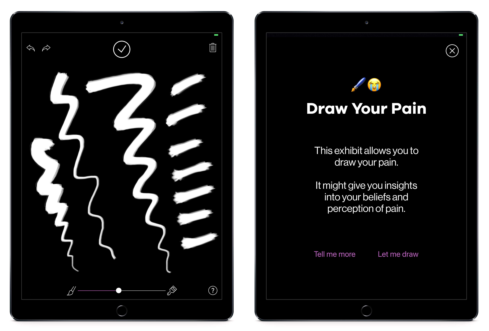

# MOD. Draw Your Pain

An iOS application to allow visitors to draw their pain levels.

## TODO:

* ~~Setup project and get JotUI running~~.
* ~~Post the image created to a web server.~~
* ~~Have that web server generate a slideshow.~~
* ~~Augment the images.~~
* ~~Add an undo/redo button.~~
* ~~Make the interface a bit prettier.~~
* ~~Create custom brush textures.~~

## Servers

A [backend server](https://github.com/MODatUniSA/mod-image-server) will accept the drawings, and play a slideshow of the images.

A [style transfer server](https://github.com/MODatUniSA/mod-fast-style-transfer) to augment the images using CNN style transfer.

## Frameworks
This app is based on the [JotUI framework](https://github.com/adamwulf/JotUI) by [Adam Wulf](http://twitter.com/adamwulf). Thanks so much Adam.

## License
The [JotUI framework](https://github.com/adamwulf/JotUI) used in this app is provided under the MIT License.

This [MOD.](https://mod.org.au) application is released under the MIT License.
